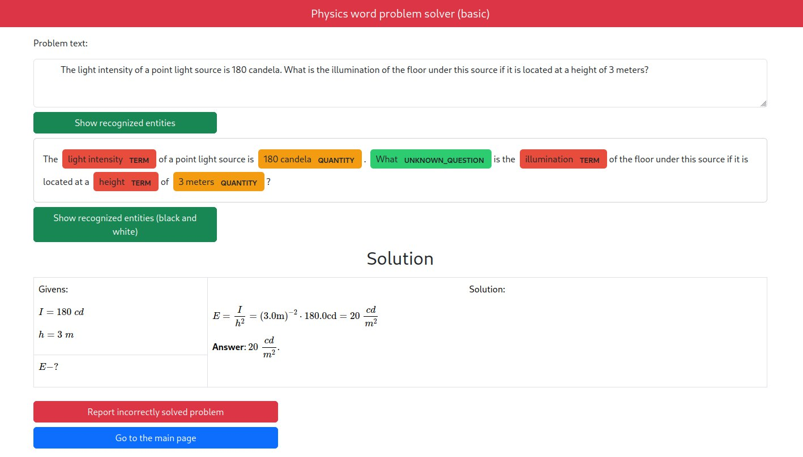

# Physics word problem solver (library part)



AI system that solves physics problems stated in natural language (without LLMs!).

To access, use this website: <https://inanyan.pythonanywhere.com>.

Website's source code: <https://github.com/InAnYan/physics-solver-web>.

Paper: <https://doi.org/10.15673/atbp.v16i2.2853>.

## Features

- Understands English language.
- Provides not only the answer, but also how it got the answer (solution steps, formulas).
- Solves 4 types of problems:
  - Value conversion.
  - Value comparison.
  - Unknowns finding.
  - Value change.
- Utilizes rule-based Natural Language Processing with modern libraries.
- Does not utilize LLMs.

To see website's features, go to <https://github.com/InAnYan/physics-solver-web>.

## How to Run this Project

Install dependencies:

```sh
pip install -r requirements.txt
```

This is a library part of the project, so you need to import it in your app.

You can look at the website's source code (<https://github.com/InAnYan/physics-solver-web>), to see how its used.

## How this Project is Implemented

Tech stack:

- `spaCy`
- `SymPy`
- `spacy_pat_match_dsl` ([this is my package, actually!](https://pypi.org/project/spacy-pat-match-dsl/))

Algorithm:

- At first, the text is pre-processed and named entities are recognized.
- Then, the program tries to determine the type of the question.
- If the program guessed the type, an intermediate representation is constructed.
- Then, different algorithms are applied to solve the problem.
- Finally, the solution is presented to the user.

To see website's tech stack and implementation, go to <https://github.com/InAnYan/physics-solver-web>.
